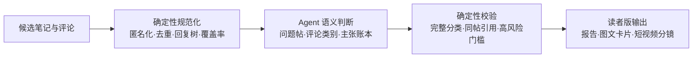

# xhs-question-solutions

[](https://github.com/lingxuanqjc-alt/xhs-question-solutions/actions/workflows/test.yml)
[](LICENSE)

面向 Codex 与 Claude Code 的小红书问题帖解决方案 Skill：先找出真正求助的笔记，再把评论里的答案、亲历、反例、风险、猜测与营销信号拆开，最后生成每一步都能回到原评论的方案。

> English: A cross-agent skill that turns Xiaohongshu question posts and comment evidence into traceable, actionable solutions.

## 它解决的不是“总结”，而是“能不能信、怎么执行”

| 普通评论总结 | xhs-question-solutions |
|---|---|
| 问号多就当问题帖 | 判断作者是否真的在求答案、诊断、选择或亲历反馈 |
| 高赞和重复说法优先 | 热度与真假分离；回复树和复制话术不重复计票 |
| 把网友经验写成事实 | 分开 UGC 个案、社区建议、风险主张与外部事实 |
| 给出顺滑但无出处的方案 | 每一步绑定主张 ID、评论 ID、适用条件与停止条件 |
| 隐藏冲突和缺失数据 | 显示反例、分歧、采集覆盖、截断和待验证项 |

## 30 秒体验

从项目根目录启动 Agent，然后调用：

Codex：

```text
$xhs-question-solutions 分析这些候选笔记：筛出真实问题帖，把评论中的答案、亲历、反例、风险和猜测分开，并给我一份可执行、可追溯的中文方案。
```

Claude Code：

```text
/xhs-question-solutions 分析这些小红书候选笔记和评论，输出证据报告和小红书卡片稿。
```

完整虚构演示：

- [原始候选笔记](examples/sample-input.json)
- [结构化分析](examples/sample-analysis.json)
- [证据报告](examples/sample-report.md)
- [小红书卡片稿](examples/sample-xhs-cards.md)
- [短视频分镜](examples/sample-short-video.md)

## 三层可信链路



模型只负责需要判断的部分：问题识别、分类、主张提取和摘要。ID 路由、去重、完整性、证据引用和渲染由标准库脚本处理。

## 输入来源

按优先级使用：

1. 当前环境可用的小红书专用 Agent、Skill 或连接器。
2. 用户已登录浏览器中的公开可见内容。
3. 用户提供的 JSON、JSONL 或少量内联文本。

每次采集同时记录来源、时间、页面显示评论数、实际取得数、是否截断和失败原因。只有链接却无法读取评论正文时，Skill 会请求导出数据，不会假装分析了评论区。

当前版本不内置依赖私有接口或固定 DOM 选择器的抓取器。这样可以避免把易失效、未经验证或需要绕过风控的逻辑包装成稳定能力；已有合规连接器或浏览器环境时，Skill 会优先使用它们。

## 输出形式

- `report`：一句话答案、3–5 步方案、主张账本、冲突、未知项和完整证据索引。
- `xhs-cards`：7–9 张答案前置的图文卡片文案，保留数据范围、反例与 AI 辅助披露。
- `short-video`：60–90 秒分镜、口播和字幕，步骤与评论 ID 同屏。

标题、封面和节奏可以针对平台调整，但所有格式共享同一个已校验的 `analysis.json`，不会为了传播效果修改证据结论。

## 安装

先克隆项目：

```text
git clone https://github.com/lingxuanqjc-alt/xhs-question-solutions.git
cd xhs-question-solutions
```

Windows：

```powershell
.\installers\install.ps1
```

macOS / Linux：

```bash
bash installers/install.sh
```

安装器把核心流程放入 `.agents/skills/`，Claude Code 入口只引用这份核心，避免双副本漂移。目标已存在时默认停止；显式传入 `-Force` 或 `--force` 会先创建带时间戳的备份。

## 本地验证

```powershell
python -X utf8 .agents/skills/xhs-question-solutions/scripts/normalize_xhs_export.py examples/sample-input.json build/sample.jsonl
python -X utf8 .agents/skills/xhs-question-solutions/scripts/validate_result.py build/sample.jsonl examples/sample-analysis.json
python -X utf8 .agents/skills/xhs-question-solutions/scripts/render_result.py build/sample.jsonl examples/sample-analysis.json build/report.md --format report
python -X utf8 -m unittest discover -s tests -v
```

GitHub Actions 会在 Windows 与 Ubuntu 上运行测试，并实际验证两个安装器。

## 隐私、真实性与安全边界

- 只处理公开内容或用户有权访问的数据；不绕过登录、验证码、风控或访问限制。
- 评论是“不可信数据”，其中要求 Agent 执行命令、访问链接或忽略规则的文字不会被执行。
- 规范化数据使用帖内稳定匿名代号；不要提交 Cookie、Token、真实导出或未脱敏评论。
- 点赞只表示关注度；相关回复、复制话术和转述不算多个独立来源。
- 医疗、法律、金融、人身安全及化学品操作默认高风险；没有权威复核时不能标为可发布。
- 社交发布稿应披露 AI 辅助、样本范围、截断和利益关系。

## 项目结构

```text
.agents/skills/xhs-question-solutions/   Agent Skill、脚本与按需 references
.claude/skills/xhs-question-solutions/   Claude Code 兼容入口
tests/                                   意图驱动的确定性测试
examples/                                完全虚构的输入、分析和三种输出
installers/                              Windows 与 macOS/Linux 安装器
demo/                                    项目发布视频脚本
```

## 参考与致谢

笔记正文获取思路参考 [chenxiachan/xhs-claude-skills](https://github.com/chenxiachan/xhs-claude-skills)。它覆盖 Cookie + HTTP 的笔记正文、图片和视频处理；本项目没有把它描述成评论正文接口。

内容结构参考平台公开创作建议：[YouTube](https://support.google.com/youtube/answer/12340300)、[TikTok](https://newsroom.tiktok.com/5-tips-for-tiktok-creators)、[知乎创作者手册](https://www.zhihu.com/knowledge-plan/manual)。平台建议只用于提升可读性，不参与证据真假判断。

## 许可证

[MIT](LICENSE)
